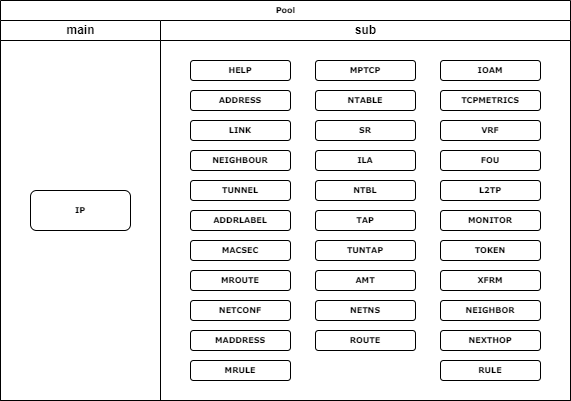

# NUX-Root / Iproute2 Linux CLi
Notes on project implementation with Linux.

 

 

# TABLE OF CONTENTS
- [TABLE OF CONTENTS](#table-of-contents)
- [PREFACE](#preface)
    - [Why iproute2?](#why-iproute2)
    - [History](#history)
    - [Key Technologies Supported by iproute2](#key-technologies-supported-by-iproute2)
- [COMMONLY USED COMMANDS](#commonly-used-commands)
    - [ip link](#ip-link)
    - [ip addr](#ip-addr)
    - [ip route](#ip-route)
    - [ip rule](#ip-rule)
    - [ip neigh](#ip-neigh)
    - [ip monitor](#ip-monitor)

---

# PREFACE
**iproute2** is a modern, complete replacement for **net-tools** with many improvements in performance, security and IPv6 support. If you are familiar with **net-tools**, switching to **iproute2** will help you manage your Linux network more effectively.

## Why iproute2?
- Most Linux distributions, and most UNIX's, currently use the venerable `arp`, `ifconfig` and `route` commands. While these tools work, they show some unexpected behaviour under Linux 2.2 and up. For example, GRE tunnels are an integral part of routing these days, but require completely different tools.
- With iproute2, tunnels are an integral part of the tool set.
- The 2.2 and above Linux kernels include a completely redesigned network subsystem. This new networking code brings Linux performance and a feature set with little competition in the general OS arena. In fact, the new routing, filtering, and classifying code is more featureful than the one provided by many dedicated routers and firewalls and traffic shaping products.
- As new networking concepts have been invented, people have found ways to plaster them on top of the existing framework in existing OSes. This constant layering of cruft has lead to networking code that is filled with strange behaviour, much like most human languages. In the past, Linux emulated SunOS's handling of many of these things, which was not ideal.
- This new framework makes it possible to clearly express features previously beyond Linux's reach.

## History
- In the late 1990s, **Alexey Kuznetsov**, a Linux kernel developer, created `iproute2` to replace `net-tools`. This tool was designed to work with Linux Kernel 2.2 and above, providing better support for new networking features.

| Years | Event |
|-------|------------------------------------------------------------------------------------|
| 1999  | `iproute2` was born, gradually replacing `net-tools`. Supports IPv4, advanced routing. |
| 2002  | Linux Kernel 2.4 improves many networking features, iproute2 continues to be expanded. |
| 2003-2005 | Stronger support for IPv6, **`iproute2` becomes the default tool on new Linux distributions.** |
| 2007-2010 | Linux Kernel 2.6 is released with major networking improvements, `iproute2` continues to evolve to support Netlink API. |
| 2015-2018 | `iproute2` updated to support `network namespaces`, `container networking` (*for Docker, Kubernetes*). |
| 2020 - now | Continued development, support for XDP, eBPF, Traffic Control (QoS) and new technologies in the Linux Kernel. |

## Key Technologies Supported by iproute2
1. **IPv6** – Full support, while `net-tools` has only limited support.
2. **Netlink API** – Communicates directly with the Kernel, making the ip command faster than `ifconfig`.
3. **Policy-Based Routing** – Policy based routing (ip rule), supports multiple routing tables (ip route).
4. **Traffic Control (QoS)** – Bandwidth control and queue management (`tc`).
5. **Network Namespace** – Supports container networking (Docker, Kubernetes).

## Refer to original document
- **iproute2 source code on kernel.org**: https://www.kernel.org/pub/linux/utils/net/iproute2/
- **Official Git Repository**:  https://git.kernel.org/pub/scm/network/iproute2/iproute2.git
- **iproute2 manual (man pages)**: https://man7.org/linux/man-pages/man8/
- **Linux Foundation Networking Guide**: https://wiki.linuxfoundation.org/networking/iproute2
- **Arch Linux Wiki on iproute2 (very detailed)**: https://wiki.archlinux.org/title/Iproute2
- **Debian Wiki about iproute2**: https://wiki.debian.org/IPRoute2

# COMMONLY USED COMMANDS

## ip link
- Synopsis: 
    `ip link [help | show | add | delete | set]` 
- Description:
    - The `ip link` command in `iproute2` is used to manage network interfaces. It allows displaying information, enabling/disabling, renaming, configuring MTU, and changing the MAC address of the network card.
- Parameter: 
    `help` : show help. 
    `show` : list all network interfaces. 
    `add` : add network interface. 
    `delete` : delete network interface. 
    `set` : set network interface. 
    *For more, please refer to the original document.*
- Examples:
    - `ip link show` : View list of network interfaces.
    - `ip link show dev eth0` : List a specific interface.
    - `ip -brief link show` : Display information in a concise form.
    - `ip link set eth0 up` : Enable network interface eth0.
    - `ip link set eth0 down` : Disable the eth0 network interface.
    - `ip link set eth0 name wan0` : Rename network interface eth0 to wan0.
    - `ip link set eth0 down && ip link set eth0 up` : Restart network interface.

## ip addr
- Synopsis: 
    `ip addr [help | show | add | del | change | replace | flush]` 
    *Note: the full command is `ip address` but can be abbreviated as `ip addr`.*
- Description:
    - The `ip addr` command in `iproute2` is used to manage IP addresses on network interfaces in Linux. It can display, add, delete, and change IP addresses, as well as configure related parameters such as broadcast, netmask, and scope.
- Parameter: 
    `help` : show help. 
    `show` : list all ip network. 
    `add` : add ip network. 
    `del` : delere ip network. 
    *For more, please refer to the original document.*
- Examples:
    - `ip addr show` : List all IP addresses on all interfaces.
    - `ip addr show dev eth0` :  List the IP address of a specific interface (eth0).
    - `ip -brief addr show` : Displays IP address in short form.
    - `ip addr add 192.168.1.100/24 dev eth0` : Add IPv4 address to interface eth0.
    - `ip addr add 192.168.1.100/24 brd 192.168.1.255 dev eth0` : Add IP address with specific broadcast.
    - `ip addr del 192.168.1.100/24 dev eth0` : Remove IPv4 address from eth0.
    - `ip addr flush dev eth0` : Delete all IP addresses on eth0.
    - `ip addr show | grep dynamic` : View address assigned by DHCP.
    - `ip addr add 192.168.2.100/24 dev eth0 label eth0:1` : Add IP alias on eth0:1.

## ip route
- Description:
    - The `ip route` command is used to manage the routing table in Linux. It allows displaying, adding, deleting and changing routes in the network system.
- Usage:
    - `ip route { list | flush } SELECTOR`
    - `ip route save SELECTOR`
    - `ip route restore`
    - `ip route showdump`
    - `ip route get [ ROUTE_GET_FLAGS ] ADDRESS [ from ADDRESS iif STRING ] [ oif STRING ] [ tos TOS ] [ mark NUMBER ] [ vrf NAME ] [ uid NUMBER ] [ ipproto PROTOCOL ] [ sport NUMBER ] [ dport NUMBER ]`
    - `ip route { add | del | change | append | replace } ROUTE`
- Parameter:
    - SELECTOR := [ root PREFIX ] [ match PREFIX ] [ exact PREFIX ] [ table TABLE_ID ] [ vrf NAME ] [ proto RTPROTO ] [ type TYPE ] [ scope SCOPE ]
    - ROUTE := NODE_SPEC [ INFO_SPEC ]
    - NODE_SPEC := [ TYPE ] PREFIX [ tos TOS ] [ table TABLE_ID ] [ proto RTPROTO ] [ scope SCOPE ] [ metric METRIC ] [ ttl-propagate { enabled | disabled } ]
    - INFO_SPEC := { NH | nhid ID } OPTIONS FLAGS [ nexthop NH ]...
    - NH := [ encap ENCAPTYPE ENCAPHDR ] [ via [ FAMILY ] ADDRESS ] [ dev STRING ] [ weight NUMBER ] NHFLAGS
    - FAMILY := [ inet | inet6 | mpls | bridge | link ]
    - OPTIONS := FLAGS [ mtu NUMBER ] [ advmss NUMBER ] [ as [ to ] ADDRESS ] [ rtt TIME ] [ rttvar TIME ] [ reordering NUMBER ] [ window NUMBER ] [ cwnd NUMBER ] [ initcwnd NUMBER ] [ ssthresh NUMBER ] [ realms REALM ] [ src ADDRESS ] [ rto_min TIME ] [ hoplimit NUMBER ] [ initrwnd NUMBER ] [ features FEATURES ] [ quickack BOOL ] [ congctl NAME ] [ pref PREF ] [ expires TIME ] [ fastopen_no_cookie BOOL ]
    - TYPE := { unicast | local | broadcast | multicast | throw | unreachable | prohibit | blackhole | nat }
    - TABLE_ID := [ local | main | default | all | NUMBER ]
    - SCOPE := [ host | link | global | NUMBER ]
    - NHFLAGS := [ onlink | pervasive ]
    - RTPROTO := [ kernel | boot | static | NUMBER ]
    - PREF := [ low | medium | high ]
    - TIME := NUMBER[s|ms]
    - BOOL := [1|0]
    - FEATURES := ecn
    - ENCAPTYPE := [ mpls | ip | ip6 | seg6 | seg6local | rpl | ioam6 | xfrm ]
    - ENCAPHDR := [ MPLSLABEL | SEG6HDR | SEG6LOCAL | IOAM6HDR | XFRMINFO ]
    - SEG6HDR := [ mode SEGMODE ] segs ADDR1,ADDRi,ADDRn [hmac HMACKEYID] [cleanup]
    - SEGMODE := [ encap | encap.red | inline | l2encap | l2encap.red ]
    - SEG6LOCAL := action ACTION [ OPTIONS ] [ count ]
    - ACTION := { End | End.X | End.T | End.DX2 | End.DX6 | End.DX4 | End.DT6 | End.DT4 | End.DT46 | End.B6 | End.B6.Encaps | End.BM | End.S | End.AS | End.AM | End.BPF }
    - OPTIONS := OPTION [ OPTIONS ]
    - OPTION := { flavors FLAVORS | srh SEG6HDR | nh4 ADDR | nh6 ADDR | iif DEV | oif DEV | table TABLEID | vrftable TABLEID | endpoint PROGNAME }
    - FLAVORS := { FLAVOR[,FLAVOR] }
    - FLAVOR := { psp | usp | usd | next-csid }
    - IOAM6HDR := trace prealloc type IOAM6_TRACE_TYPE ns IOAM6_NAMESPACE size IOAM6_TRACE_SIZE
    - XFRMINFO := if_id IF_ID [ link_dev LINK ]
    - ROUTE_GET_FLAGS := [ fibmatch ]
- Examples:
    - `ip route show` : List all active routes.
    - `ip -brief route show` : List the routing table in a concise form.
    - `ip route show table main` : List routes according to a specific routing table (main).
    - `ip route get 8.8.8.8` : List routes by destination IP address.
    - `ip route add 192.168.2.0/24 via 192.168.1.1` : Add route to subnet `192.168.2.0/24` via `gateway 192.168.1.1`.
    - `ip route add default via 192.168.1.1` : Add default route via `gateway 192.168.1.1`.
    - `ip route add 192.168.3.0/24 dev eth0` : Add a route that applies only to a specific network interface (eth0).
    - `ip route del 192.168.2.0/24` : Remove route to network `192.168.2.0/24`.
    - `ip route del default` : Delete default route.
    - `ip route replace 192.168.2.0/24 via 192.168.1.254` : Replace the route to `192.168.2.0/24` through a new gateway `192.168.1.254`.
    - `ip route add default nexthop via 192.168.1.1 dev eth0 nexthop via 192.168.1.2 dev eth1` : Set up two load balancing routes with equal weights.
    - `ip route add default via 192.168.1.1 metric 100` : Set default route with lower priority metrics (*higher priority has smaller number of metrics*).
    - `ip route get 8.8.8.8` : Check the packet route that will go to IP `8.8.8.8`.
    - `ip route get 8.8.8.8 from 192.168.1.100` : Test the route to the specific address `8.8.8.8` from a specific source address `192.168.1.100`.

## ip rule

## ip neigh

## ip monitor

*[Back to Top](#nux-root--iproute2-linux-cli)*