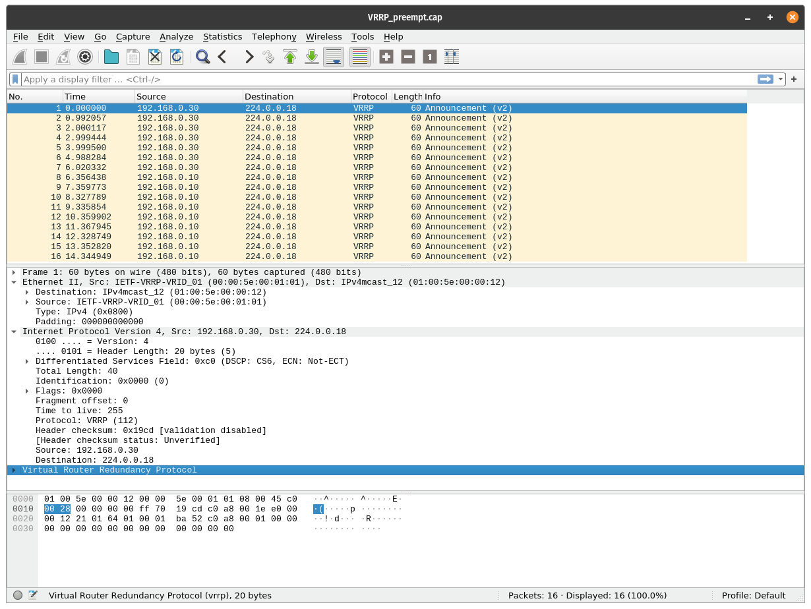

# NUX-Root / KeepAlived Linux CLi
Notes on project implementation with Linux.

[](KeepAlived-CLi.md)
[](KeepAlived-CLi.vi.md)
[](../README.md)<br/>
[](https://github.com/quachdoduy/NUX-Root/stargazers)
[](https://github.com/quachdoduy/NUX-Root/watchers)<br/>
[](https://paypal.me/quachdoduy)
[](https://buymeacoffee.com/quachdoduy)

# TABLE OF CONTENTS
- [TABLE OF CONTENTS](#table-of-contents)
- [PREFACE](#preface)
    - [Refer to original document](#refer-to-original-document)
    - [Refer to expanded document](#refer-to-expanded-document)
- [BASIC INSTRUCTIONS](#basic-instructions)
    - [Install](#install)
    - [Check Status](#check-status)
- [ADVANCED INSTRUCTIONS](#advanced-instructions)

---


# PREFACE
- **Keepalived** is a routing software written in C. The main goal of this project is to provide simple and robust facilities for loadbalancing and high-availability to Linux system and Linux based infrastructures. Loadbalancing framework relies on well-known and widely used Linux Virtual Server (IPVS) kernel module providing Layer4 loadbalancing. **Keepalived** implements a set of checkers to dynamically and adaptively maintain and manage loadbalanced server pool according their health. On the other hand high-availability is achieved by VRRP protocol. VRRP is a fundamental brick for router failover. In addition, **Keepalived** implements a set of hooks to the VRRP finite state machine providing low-level and high-speed protocol interactions. In order to offer fastest network failure detection, **Keepalived** implements BFD protocol. VRRP state transition can take into account BFD hint to drive fast state transition. **Keepalived** frameworks can be used independently or all together to provide resilient infrastructures.
- **Keepalived is free software**; you can redistribute it and/or modify it under the terms of the GNU General Public License as published by the Free Software Foundation; either version 2 of the License, or (at your option) any later version.

## Refer to original document
- webpage: https://www.keepalived.org/
- github: https://github.com/acassen/keepalived/
- user guide: https://keepalived.readthedocs.io
- social: https://x.com/keepalived

## Refer to expanded document
- RFC 9568: https://datatracker.ietf.org/doc/html/rfc9568

---

# BASIC INSTRUCTIONS

## Install
- Install keepalived (for all nodes in cluster).
```
sudo apt install -y keepalived
```
- Modify keepalived.conf file.
```
sudo nano /etc/keepalived/keepalived.conf
```
- The short form is as follows.
```
vrrp_instance string {          # identify a VRRP instance definition block
    state MASTER|BACKUP         # specify the instance state in standard use
    interface string            # specify the network interface for the instance to run on
    virtual_router_id num       # specify to which VRRP router id the instance belongs
    priority num                # specify the instance priority in the VRRP router (range from 1 to 255)
    advert_int num              # specify the advertisement interval in seconds (set to 1)
    authentication {            # identify a VRRP authentication definition block
        auth_type PASS|AH       # specify which kind of authentication to use (PASS|AH)
        auth_pass string        # specify the password string to use
    }
    virtual_ipaddress {         # identify a VRRP VIP definition block (Block limited to 20 IP addresses) 
        @IP
        @IP
        @IP
    }
}
```
- Example.
```
# *Node Master*
vrrp_instance VipKA {
    state MASTER
    interface ens33
    virtual_router_id 69
    priority 100
    advert_int 1
    authentication {
        auth_type PASS
        auth_pass V3ryS3cr3t
    }
    virtual_ipaddress {
        192.168.69.1
    }
}
```
```
# *Node Backup*
vrrp_instance VipKA {
    state BACKUP
    interface ens33
    virtual_router_id 69
    priority 99
    advert_int 1
    authentication {
        auth_type PASS
        auth_pass V3ryS3cr3t
    }
    virtual_ipaddress {
        192.168.69.1
    }
}
```
-  Restart keepalived service.
```
sudo systemctl restart keepalived
```

## Check Status
- Check which node is the Master.
```
ip addr show | grep "Virtual_IP"
```
- View Keepalived VRRP status.
```
watch -n 1 "ip -br addr show dev your_NIC_nae"
```
- View Keepalived log.
```
journalctl -u keepalived --no-pager | tail -50
```

# ADVANCED INSTRUCTIONS
- The Master election process is divided into 3 main stages, following the latest standards currently issued for VRRP version 3.
    - Initialize
    - Active
    - Backup


- A VRRP virtual router uses the **MAC address 00:00:5E:00:01:XX**, being XX the Virtual Router Identifier (VRID), which is different for each virtual router in the network. Physical routers within the virtual router (that means, each instance spawned in a host which is part of a virtual router) must communicate within themselves using packets with **multicast address 224.0.0.18** and **IP protocol 112**. In a nutshell, this is what you’ll see capturing in the HA interface:



*[Back to Top](#nux-root--keepalived-linux-cli)*