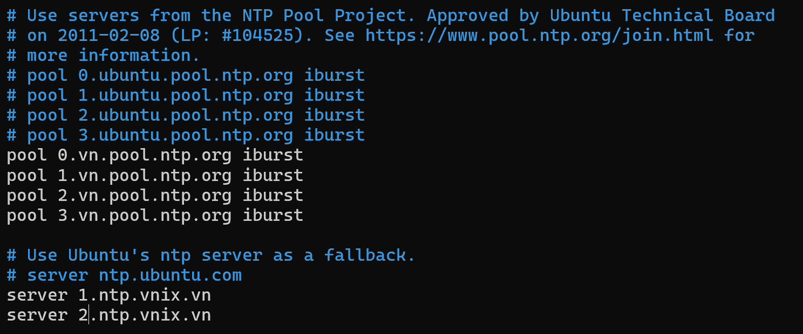

# NUX-Root / NTP Server Linux
Notes on project implementation with Linux.

[](NtpSvr-CLi.md)
[](NtpSvr-CLi.vi.md)
[](../README.md)<br/>
[](https://github.com/quachdoduy/NUX-Root/stargazers)
[](https://github.com/quachdoduy/NUX-Root/watchers)<br/>
[](https://paypal.me/quachdoduy)
[](https://buymeacoffee.com/quachdoduy)

# TABLE OF CONTENTS
- [TABLE OF CONTENTS](#table-of-contents)
- [PREFACE](#preface)
    - [Refer to original document](#refer-to-original-document)
    - [Refer to expanded document](#refer-to-expanded-document)
- [BASIC INSTRUCTIONS](#basic-instructions)
    - [Install the NTP Service](#install-the-ntp-service)
    - [Configure NTP Servers](#configure-ntp-servers)
    - [Configure NTP Client](#configure-ntp-client)
    - [Check Status](#check-status)
- [ADVANCED INSTRUCTIONS](#advanced-instructions)

---


# PREFACE
NTP (Network Time Protocol) is a protocol used to synchronize all system clocks in a network to use the same time. 
NTP belongs to the traditional TCP/IP protocol suite and is also the oldest service in the computer science foundation.

- Below are 3 popular NTP services on server systems.
    * NTP
    * Chrony
    * NTPsec

- Comparison of NTP Server versions on Linux: Chrony, NTPsec and NTP.

| **Tính năng** | **NTP (Classic NTPd)** | **Chrony** | **NTPsec** |
|:---|:---|:---|:---|
| Developed by | Network Time Foundation | Red Hat | NTPsec Project |
| Main objective | Traditional NTP service, fully supporting time synchronization features. | Optimized for intermittent environments, can work well with unstable system clocks. | Highly secure version, lighter than traditional NTP. |
| Security | Less secure due to its long history and many security holes. | There are security improvements but not a strong focus on security. | Specifically designed to eliminate security vulnerabilities in traditional NTP. |
| Efficiency | Works fine but has higher latency in mobile systems or unstable networks. | Higher performance, faster synchronization in constantly changing environments. | Lighter than NTPd, improves performance and reduces latency. |
| Use in practice | Suitable for systems that require precise synchronization but do not need optimal performance. | Better for mobile systems, servers that lose network connection temporarily. | Good for systems that require high security. |
| Simple configuration | More difficult to configure than Chrony. | Simple configuration, easy to customize. | The configuration is similar to traditional NTP but focuses on security. |
| Support NTS (Network Time Security) protocol | Not supported. | Not supported. | Support available. |

## Refer to original document
- website: https://www.ntppool.org
- wiki: https://en.wikipedia.org/wiki/Network_Time_Protocol
- rfc-867: https://datatracker.ietf.org/doc/html/rfc867
- rfc-868: https://datatracker.ietf.org/doc/html/rfc868

## Refer to expanded document
- NTP (Classic NTPd)
    * website: https://www.ntp.org
    * manual:  https://doc.ntp.org
- Chrony
    * website: https://chrony.tuxfamily.org
    * manual:  https://chrony.tuxfamily.org/documentation.html
- NTPsec
    * website: https://www.ntpsec.org
    * manual:  https://docs.ntpsec.org

---

# BASIC INSTRUCTIONS
## Install the NTP Service
- Start by updating your package lists to ensure you have the latest version of the repositories.
```
sudo apt update && sudo apt upgrade -y
```
- Install the NTP package using the following command.
```
sudo apt install -y ntp
```
*This command installs the NTP service on your Ubuntu system, making it ready for configuration.*

- Verify your NTP installation and also check the version number by running the following command.
```
sntp --version
```

## Configure NTP Servers
- Configuring your NTP servers is a critical step. Open the NTP configuration file in a text editor of your choice. Here, nano is used for simplicity.
```
sudo nano /etc/ntpsec/ntp.conf
```
- In the configuration file, add or modify the server lines to specify your preferred NTP servers. For example:


*Note: In the example, 2 VNNIC NTP servers are used, which are published on the homepage.*

## Configure NTP Client
- Change TimeZone.
```
sudo timedatectl set-timezone Asia/Ho_Chi_Minh
```

## Check Status
- Check Service NTP.
```
sudo systemctl status ntp
```
- Check queue NTP.
```
ntpq -p
```
- Check DateTime.
```
date
```


---

# ADVANCED INSTRUCTIONS

*[Back to Top](#nux-root--ntp-server-linux)*